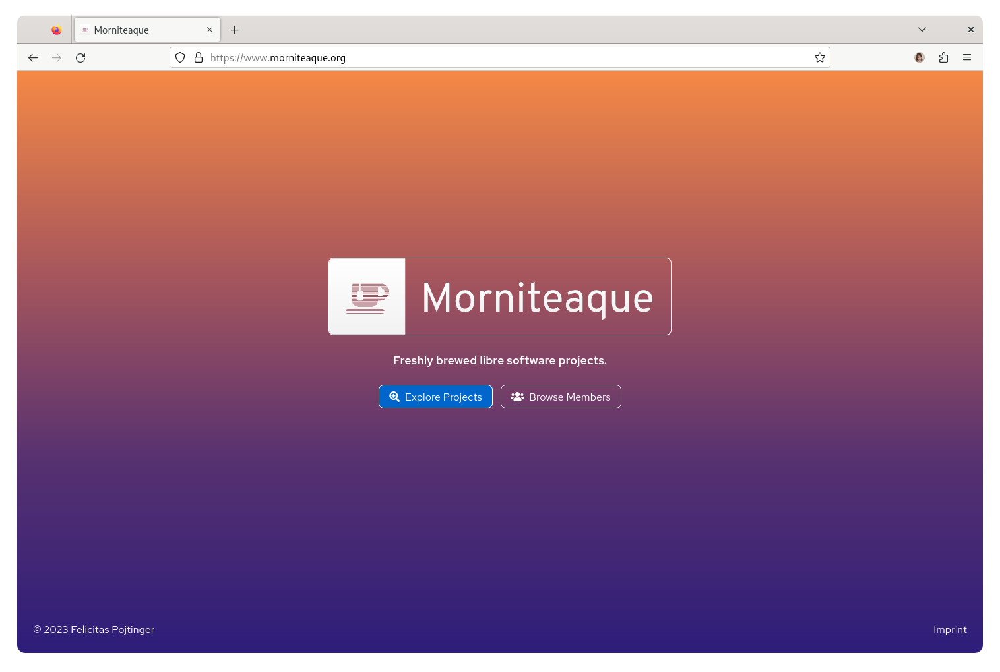
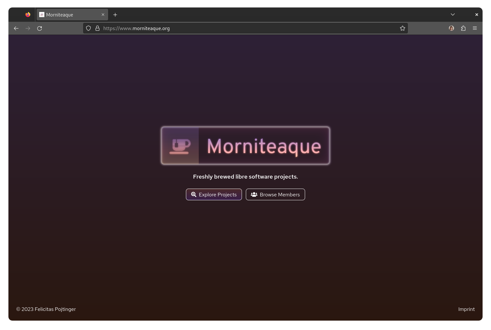

# Morniteaque Site

Site for Morniteaque.

<br/>

## Overview

This is the landing page for Morniteaque. It's a very simple link aggregator at the moment, but might grow to be more in the future.

## Installation

The web app is available on [GitHub releases](https://github.com/morniteaque/morniteaque.org/releases) in the form of a static `.tar.gz` archive; to deploy it, simply upload it to a CDN or copy it to a web server. For most users, this shouldn't be necessary though; simply visit the [public deployment](https://morniteaque.org/) to access it:

[](https://www.morniteaque.org/)

## Screenshots

Click on an image to see a larger version.

<a display="inline" href="./docs/screenshot-light.png?raw=true">

</a>

<a display="inline" href="./docs/screenshot-dark.png?raw=true">

</a>

## Acknowledgements

- [gohugoio/hugo](https://github.com/gohugoio/hugo) provides the static site generator.
- The open source [PatternFly design system](https://www.patternfly.org/v4/) provides the components for the project.

## Contributing

To contribute, please use the [GitHub flow](https://guides.github.com/introduction/flow/) and follow our [Code of Conduct](./CODE_OF_CONDUCT.md).

To build the site locally, run:

```shell
$ git clone https://github.com/morniteaque/morniteaque.org.git
$ cd morniteaque.org
$ make depend
$ make dev
```

## License

Morniteaque Site (c) 2024 Felicitas Pojtinger and contributors

SPDX-License-Identifier: AGPL-3.0
